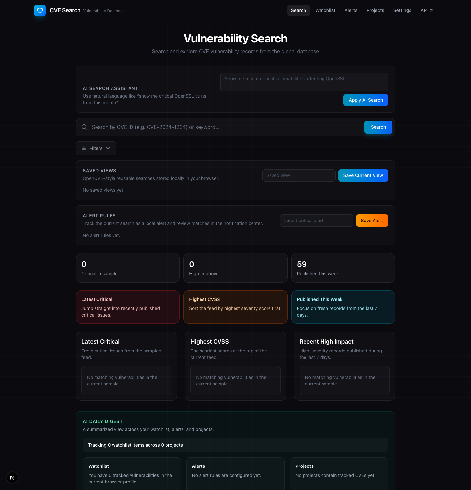
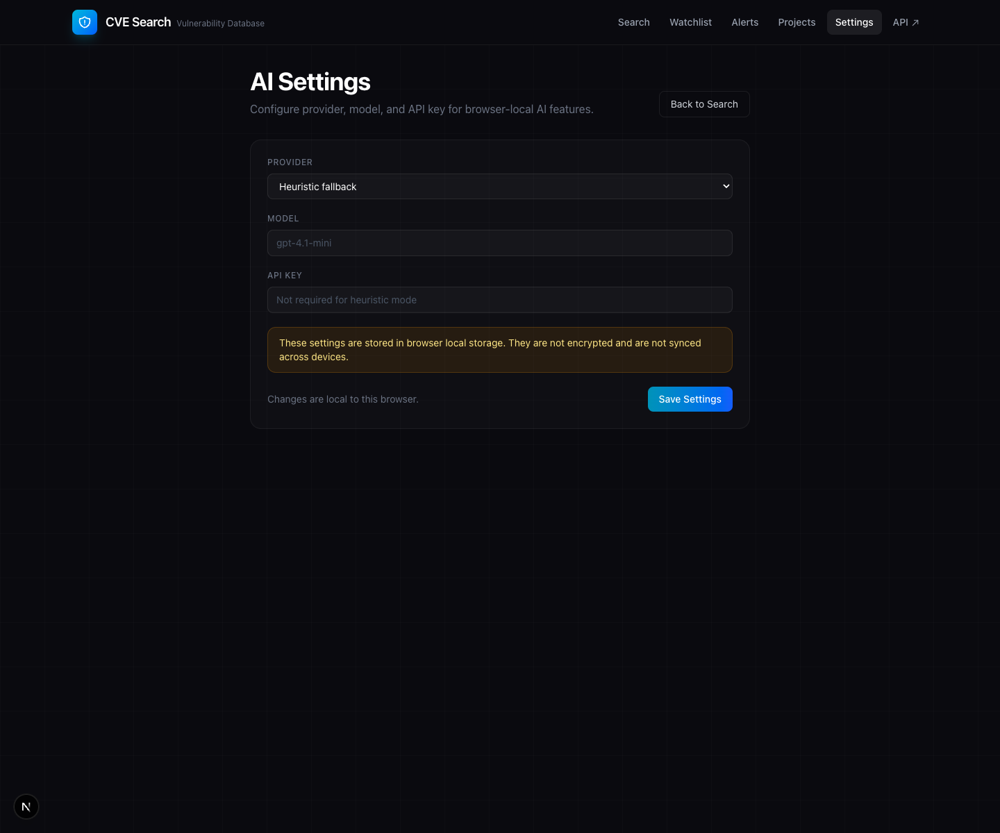

# CVE Search

Fast, analyst-friendly CVE search, GitHub repository monitoring, and automated vulnerability remediation built with Next.js.

[](https://nextjs.org/)
[](https://react.dev/)
[](https://www.typescriptlang.org/)
[](https://tailwindcss.com/)
[](./LICENSE)

## Overview

CVE Search turns raw vulnerability data into a workflow-oriented web app for research, prioritization, and operational tracking.

It combines URL-driven search, rich CVE detail pages, saved views, watchlists, alerts, triage state, project workflows, team notifications, and a conversational workspace in a single interface. The app is designed to feel closer to an analyst workstation than a simple API browser.

It also includes an optional AI layer for natural-language search, analyst-facing CVE summaries, remediation guidance, workspace digests, and workspace Q&A, with provider settings managed server-side through environment variables.

The GitHub Repos feature connects private and public repositories, scans their dependency trees for known vulnerabilities via the OSV.dev API, persists scan history in SQLite, and can automatically generate fix PRs using AI.

## Screenshots

### Search Workspace

URL-driven search, saved views, alert rules, analyst dashboard presets, and AI-assisted search in one screen.



### CVE Detail View

Structured vulnerability detail with AI insight, triage state, CVSS context, affected products, and linked references.


### AI Settings

Browser-local AI provider settings for choosing the provider, model, and API key used by AI workflows.



## Highlights

- URL-driven search state for shareable result pages
- Direct CVE lookup plus keyword/product search
- Vendor and product browse assist
- Severity filters and result sorting
- Server-rendered homepage results
- Rich CVE detail pages with EPSS, CWE, CAPEC, references, comments, and linked vulnerabilities when available
- Saved views, watchlist, alerts, notifications, and triage workflow
- Server-persisted projects workspace with owner, due date, labels, status, SLA, and exception tracking
- AI-assisted search, summaries, triage guidance, workspace digests, and conversational workspace answers
- GitHub repository monitoring with deep dependency scanning (npm, pnpm, Composer) across monorepo subdirectories
- Persisted repository scan history for monitored repos
- AI-powered vulnerability fix generation with automatic pull request creation
- Duplicate PR detection to avoid redundant fix branches
- Export to CSV and JSON
- Upstream response validation and hardened proxy behavior

## Feature Set

### Search and Prioritization

- Search by CVE ID such as `CVE-2024-1234`
- Search by keyword or product
- Filter by vendor/product pair, CWE, published-since date, and minimum severity
- Sort by newest, oldest, highest CVSS, or lowest CVSS
- Copy deep links to exact search states

### Analyst Workflow

- Save reusable searches as server-persisted saved views
- Bookmark CVEs and advisories in a server-persisted watchlist
- Create alert rules, review matches in an alerts center, and schedule digest delivery for team destinations
- Track triage status, owner, tags, and notes with approval checkpoints
- Group CVEs into server-persisted projects with owners, due dates, labels, status, timeline events, per-item assignment, SLA tracking, remediation state, and exceptions
- Ask the workspace assistant questions over watchlist, alerts, projects, and saved searches

### AI Workspace

- Translate natural-language prompts into structured search filters
- Generate analyst-friendly CVE summaries and triage recommendations
- Draft remediation notes from affected products, references, and available metadata
- Build watchlist, alerts, and project digests from current workspace context
- Answer workspace questions over saved views, watchlist, alerts, and project workflow state
- Configure provider and model with server-side environment variables and per-feature overrides

### Vulnerability Detail

- CVSS score breakdown and severity badges
- EPSS lookup when a real CVE identifier is available
- Structured affected product rendering
- CWE enrichment when available
- CAPEC entries, comments, linked vulnerabilities, and references when present upstream
- Raw source payload for deeper inspection

### GitHub Repository Monitoring

- Connect private and public GitHub repositories via a personal access token
- Deep dependency scanning using the GitHub Tree API to discover dependency files across all subdirectories
- Supports npm (`package.json`, `package-lock.json`), pnpm (`pnpm-lock.yaml`), and Composer (`composer.json`, `composer.lock`)
- Batch vulnerability lookup via the OSV.dev API with CVSS v3 base score calculation
- Persisted scan snapshots per monitored repository with historical visibility in the UI
- Vulnerability detail links to internal CVE pages when a CVE alias is available
- AI-powered fix generation: analyzes the vulnerability, generates file changes, creates a branch, commits, and opens a pull request
- Heuristic fallback when no AI provider is configured (version bump to known fixed version)
- Detects existing fix PRs to prevent duplicates
- Archived and disabled repository detection with clear error messages

### Engineering Quality

- Server-rendered initial result loading
- URL-first state management
- Server-side API proxy with allowlisting and timeout handling
- Upstream response validation for key CIRCL payloads
- Automated lint, test, and build checks in CI
- Heuristic AI fallback when no model provider is configured

## Current Boundaries

- Vendor-only filtering is intentionally blocked because the current upstream flow is only trustworthy when vendor is paired with product.
- Workspace data is scoped to the app session/user cookie rather than a shared organization identity system.
- AI providers are configured with server-side environment variables; there is no in-product credential management UI.
- Notification delivery currently persists in-app schedule and delivery records; external email/Slack/webhook delivery is modeled as destinations but not actually pushed to third-party services.
- GitHub monitoring requires a valid `GITHUB_TOKEN`; without one, the Repos workflow is limited to negative-path validation.
- Lock file regeneration (`npm install`, `composer update`) must be run locally after merging AI-generated fix PRs.

## Quick Start

```bash
git clone https://github.com/rupertgermann/cvesearch.git
cd cvesearch
npm install
```

Copy the example environment file and add your GitHub token:

```bash
cp .env.example .env.local
```

Edit `.env.local` and set `GITHUB_TOKEN` to a GitHub PAT with the required scopes (see below).

```bash
npm run dev
```

Open `http://localhost:3000`.

### Environment Variables

| Variable | Required | Description |
|---|---|---|
| `GITHUB_TOKEN` | For Repos feature | GitHub Personal Access Token. Classic PAT needs `repo` scope. Fine-grained PAT needs **Contents: Read and write** and **Pull requests: Read and write**. |

### AI Configuration

To use model-backed AI features instead of the built-in heuristic fallback, configure server-side environment variables such as:

- `AI_PROVIDER`
- `OPENAI_API_KEY`
- `OPENAI_MODEL`
- `ANTHROPIC_API_KEY`
- `ANTHROPIC_MODEL`

You can also override individual flows with feature-specific variables such as `AI_SEARCH_ASSISTANT_PROVIDER`, `AI_PROJECT_SUMMARY_MODEL`, or `AI_DAILY_DIGEST_MODEL`. The `/settings` page shows the active configuration, prompt versions, tool registry, inventory assets, workspace import/export, and recent AI runs.

## Scripts

```bash
npm run dev
npm run lint
npm test
npm run build
npm start
```

## Testing

The project includes lightweight TypeScript tests for:

- search-state parsing and URL generation
- prioritization and local alert matching
- triage helpers
- upstream response validation
- project workflow logic
- repository scan persistence
- notification scheduling and digest delivery
- workspace assistant behavior
- CVSS and description extraction

GitHub Actions runs `lint`, `test`, and `build` on pushes and pull requests.

## Project Structure

```text
src/
├── app/
│   ├── api/
│   │   ├── ai/              # AI summary, search, and digest APIs
│   │   ├── github/          # GitHub integration APIs
│   │   │   ├── fix/         # AI fix generation and PR creation
│   │   │   ├── repos/       # Repository listing
│   │   │   └── scan/        # Dependency scanning
│   │   ├── projects/        # Workspace project APIs
│   │   └── proxy/           # CIRCL proxy
│   ├── alerts/              # Alerts route
│   ├── cve/[id]/            # CVE detail route
│   ├── projects/            # Projects route
│   ├── repos/               # GitHub repository monitoring route
│   ├── settings/            # Server-side AI configuration, inventory, and workspace data
│   ├── workspace/           # Conversational workspace and notifications
│   ├── watchlist/           # Watchlist route
│   └── page.tsx             # Homepage
├── components/              # Search, detail, workflow, repos, and navigation UI
└── lib/                     # Search logic, AI helpers, API clients, GitHub integration,
                             # dependency parsing, SQLite-backed storage, validation, utilities

data/
└── app.db                   # Default SQLite workspace database

tests/                       # Node-based TypeScript test suite
```

## API Usage

### CIRCL vulnerability-lookup

The app talks to CIRCL through `/api/proxy`, which forwards to `https://vulnerability.circl.lu/api`.

Primary upstream endpoints:

- `GET /api/vulnerability/`
- `GET /api/vulnerability/{id}`
- `GET /api/vulnerability/search/{vendor}/{product}`
- `GET /api/vulnerability/browse/`
- `GET /api/vulnerability/browse/{vendor}`
- `GET /api/epss/{cve_id}`
- `GET /api/cwe/{cwe_id}`

### OSV.dev

Used for dependency vulnerability scanning:

- `POST /v1/querybatch` — batch lookup of dependencies by ecosystem and version
- `GET /v1/vulns/{id}` — full vulnerability details for enrichment

### GitHub API v3

Used for repository monitoring, dependency file discovery, and PR creation:

- `GET /user/repos` — list accessible repositories
- `GET /repos/{owner}/{repo}/git/trees/{sha}?recursive=1` — discover all dependency files
- `GET /repos/{owner}/{repo}/contents/{path}` — fetch file contents
- `GET /repos/{owner}/{repo}/pulls` — check for existing fix PRs
- `POST /repos/{owner}/{repo}/git/refs` — create fix branches
- `PUT /repos/{owner}/{repo}/contents/{path}` — commit file changes
- `POST /repos/{owner}/{repo}/pulls` — open pull requests

## Docs

Planning and benchmark docs live in [`docs/`](./docs):

- `docs/review-findings.md`
- `docs/improvement-plan.md`
- `docs/execution-backlog.md`
- `docs/opencve-benchmark.md`
- `docs/test-user-journeys.md`
- [`CHANGELOG.md`](./CHANGELOG.md)

## Tech Stack

- Next.js 16
- React 19
- TypeScript 5
- Tailwind CSS 4
- CIRCL vulnerability-lookup API
- OSV.dev API
- GitHub API v3
- Optional OpenAI or Anthropic provider integration

## License

[MIT](./LICENSE)
